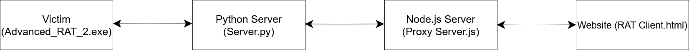

## RAT application

Advanced_RAT2 is a web based RAT developed in C++ for Windows OS.
It features a straight-forward set of [commands](#commands) that allows for near complete control of a computer.

How It Works?
---

Here the lines means that there is a direct connection between the applications, both receive and send data.

The Website sends a command to the Node.js Server, and the Node.js Server sends the command to the Python Server, and The Python server sends the command to the RAT.
The RAT executes the command and sending the output to the Python Server, and the Python Server sends the output to the Node.js Server, and the Node.js Server sends
the output to the website, and the website displays the output.

Features
---
* Remote Command Execution via CMD
* Remote Command And Scripts Execution via Powershell
* Multiple Connections
* Stealing files
* Sending files and execute them (It can be virus or any other file)
* VM running check
* invisible to all the Anti Viruses in VirusTotal.
* Can be controlled from the and from any place
* Starting after computer restart
* Hiding himself in %LOCALAPPDATA%\WindowSys.exe
* Hiding the application window
* Working on WAN
* Keylogger option
* Broadcast Clients
* Getting all the files in a directory
* If the Python server or The client (RAT) or The Node.js Server are crashed the other programs won't crash
* Can be used from everywhere and also from the phone
* Very simple to use

Videos
---
The videos are not in included the keylogger.
* [How The RAT Works](https://drive.google.com/file/d/1atuBa7pXZaMFUW8mPeOVh4UAPXo-VG2u/view)
* [How To Use The RAT](https://drive.google.com/file/d/1cnPOTTZ8qOMUUF_lvuJgyT-zr9FD_8p4/view)

Commands
---
|Command|Syntax|Comment|
|-------|------|---------|
|send file|`(send file + (The path of the file that you wanna to send))`|send the file in the path to the victim|
|recv file| `(recv file + (The path of the file that you wanna take in victim computer))`|Taking the file in the path from the victim|
|get files|`get files + (The path of the directory)`|Getting all the names of files in the path include directories and sun directories|
|cmd| `cmd + (The command that you want to execute)`|Running the command in cmd and returning the output|
|powershell| `powershell + (The command that you want to execute)`|Running the command in powershell and returning the output|'
|broadcast| `broadcast + (The command that you want to execute)`|Running the command in every single client|
|start keylogger|`start keylogger`|Starting the keylogger|
|stop keylogger|`stop keylogger`|Stopping the keylogger and sending the keylogger file to you|
|quit|`quit`|Closing the client|

Requirements
---
* None!

 
